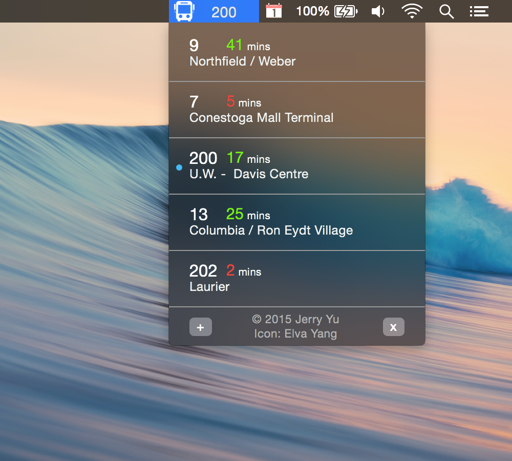

# GGrt

#### It's cold outside.

#### When should I leave to catch the bus?

#### Just glance up

- Add bus routes and have their ETA show up in your menu bar.

## Install from source
1. Download Xcode
2. Install [CocoaPods](http://cocoapods.org/): `sudo gem install cocoapods`
3. Do `git clone`
4. Do `pod install` inside the the `ggrt/mac/` folder
5. This creates `ggrt.xcworkspace`. Launch it to open Xcode
6. `Build and Run` (Play button)

## Credits
- Jerry Yu
- Elva Yang

*One of the top 10 hacks at the Kik 2015 Hackathon*
